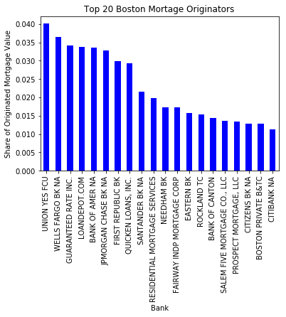
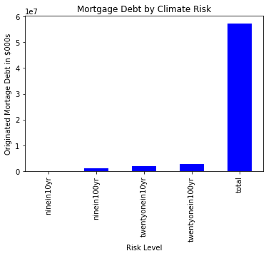
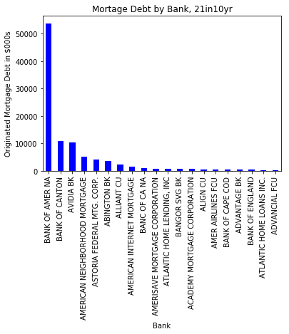
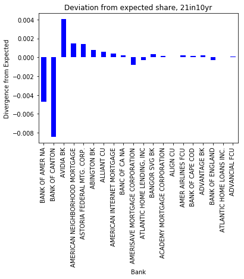
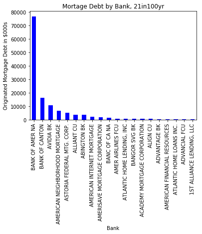
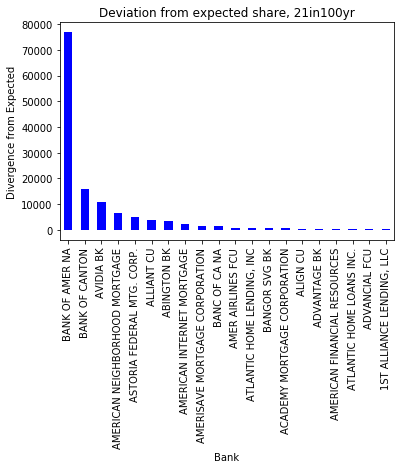

21in100yr# Second/Third Analysis of HMDA Data

Our goals:

1. Banks by $ amount and share originated, Citywide (as a CSV)
2. Risk levels by $ amount and share, Citywide (as a CSV)
3. Banks, by risk level, by $ amount, share, and delta from expected share (as 4 CSVs)

## Step 0: (From last time) setting up our high risk tracts, narrowing down to originated loans, joining in risk information.

The code below sets up a dataframe of all originated mortgages in Boston and links in whether each mortgage is in a high risk tract under various climate scenarios. We've defined high risk as >=50% flooded for now.

```python

import pandas as pd
import numpy as np
import os
import matplotlib.pyplot as plt
from tabulate import tabulate
%matplotlib inline

os.chdir("Data")

climate = pd.read_csv("climateriskbytract.csv", index_col=0)

classification = lambda x: 1 if x >= 0.50 else 0

climate['9in10yrhirisk'] = climate['9in10yr'].apply(classification)
climate['9in100yrhirisk'] = climate['9in100yr'].apply(classification)
climate['21in10yrhirisk'] = climate['21in10yr'].apply(classification)
climate['21in100yrhirisk'] = climate['21in100yr'].apply(classification)

#Checking how many tracts we get using this threshold
# climate[climate['9in10yrhirisk'] == 1].shape
# climate[climate['9in100yrhirisk'] == 1].shape
# climate[climate['21in10yrhirisk'] == 1].shape
# climate[climate['21in100yrhirisk'] == 1].shape

climate = climate[['census_tract_number','9in10yrhirisk','9in100yrhirisk','21in10yrhirisk','21in100yrhirisk']]

hmda = pd.read_csv("hmda_data.csv", index_col=0, low_memory=False)
hmdaclimate = pd.merge(hmda, climate, how='left',on='census_tract_number')
originatedclimate = hmdaclimate[hmdaclimate['action_type'] == 1].copy()

```

## Step 1: Banks by $ amount and share originated, Citywide (as a CSV)

To generate our "expected share" of mortgage debt, we'll aggregate originated mortgages by financial institution and assign each bank a percentage of overall citywide originated mortgage debt. This is saved as total.csv.  

```python

#first, we need a total count of originations

denom = sum(originatedclimate['loan_amount'])


#now, we'll sum loan values by bank for all of boston

df = originatedclimate.groupby('panel_name').sum().reset_index()
df = df[['panel_name','loan_amount']]

df['expectedshare'] = df['loan_amount'] / denom

df = df.sort_values(by=['expectedshare'], ascending=False)
df = df.set_index('panel_name')

#exporting

df.to_csv('total.csv')

#making a quick graph for posterity

total = df.head(20).copy()
total['expectedshare'].plot.bar(title='Top 20 Boston Mortage Originators', color='b')
plt.xlabel('Bank')
plt.ylabel('Share of Originated Mortgage Value')
plt.savefig('total.png', bbox_inches='tight')

```
Here's what the Top 20 banks are, citywide, by amount of debt.



## 2. Risk levels by $ amount and share, Citywide (as a CSV)

For this part, we'll aggregate mortgage loan amounts by whether they're in risky tracts for each risk scenario.

```python

ninein10yr = originatedclimate.groupby(['9in10yrhirisk']).sum().reset_index()

ninein10yr = ninein10yr.at[1,'loan_amount']

ninein100yr = originatedclimate.groupby(['9in100yrhirisk']).sum().reset_index()

ninein100yr = ninein100yr.at[1,'loan_amount']

twentyonein10yr = originatedclimate.groupby(['21in10yrhirisk']).sum().reset_index()

twentyonein10yr = twentyonein10yr.at[1,'loan_amount']

twentyonein100yr = originatedclimate.groupby(['21in100yrhirisk']).sum().reset_index()

twentyonein100yr = twentyonein100yr.at[1,'loan_amount']

denom

citywidedebtbyrisk = {'Risk':['ninein10yr','ninein100yr','twentyonein10yr','twentyonein100yr','total'],'Amount': [ninein10yr,ninein100yr,twentyonein10yr,twentyonein100yr,denom]}

citywidedebtbyrisk = pd.DataFrame(data=citywidedebtbyrisk)


citywidedebtbyrisk['Share'] = citywidedebtbyrisk['Amount'] / denom


#let's export it

citywidedebtbyrisk.to_csv('citywidedebtbyrisk.csv')


#let's throw it on a graph for funzies

citywidedebtbyrisk = citywidedebtbyrisk.set_index('Risk')

citywidedebtbyrisk['Amount'].plot.bar(title='Mortgage Debt by Climate Risk', color='b')
plt.xlabel('Risk Level')
plt.ylabel('Originated Mortage Debt in $000s')
plt.savefig('citywidedebtbyrisk.png', bbox_inches='tight')

```
Here's what that looks like. Might need some work to get the scale nice.




## Step 3: Banks, by risk level, by $ amount, share, and delta from expected share (as 4 CSVs)

We'll aggregate each risk level by banks, read in expected shares and calculate a delta

```python

expectedshare = pd.read_csv('total.csv')
expectedshare = expectedshare[['panel_name','expectedshare']]


#9 in 10 yr

originatedclimate9in10yr = originatedclimate[originatedclimate['9in10yrhirisk'] == 1]

df = originatedclimate9in10yr.groupby('panel_name').sum().reset_index()
df = df[['panel_name','loan_amount']]

riskdenom = df['loan_amount'].sum()
df['actualshare'] = df['loan_amount'] / riskdenom


df2 = pd.merge(df, expectedshare, on='panel_name', how='left')

df2['delta'] = df2['actualshare'] - df2['expectedshare']

originatedclimate9in10yr = df2.copy()


#9 in 100 yr

originatedclimate9in100yr = originatedclimate[originatedclimate['9in100yrhirisk'] == 1]

df = originatedclimate9in100yr.groupby('panel_name').sum().reset_index()
df = df[['panel_name','loan_amount']]

riskdenom = df['loan_amount'].sum()
df['actualshare'] = df['loan_amount'] / riskdenom


df2 = pd.merge(df, expectedshare, on='panel_name', how='left')

df2['delta'] = df2['actualshare'] - df2['expectedshare']

originatedclimate9in100yr = df2.copy()

#21in10yr

originatedclimate21in10yr = originatedclimate[originatedclimate['21in10yrhirisk'] == 1]

df = originatedclimate21in10yr.groupby('panel_name').sum().reset_index()
df = df[['panel_name','loan_amount']]

riskdenom = df['loan_amount'].sum()
df['actualshare'] = df['loan_amount'] / riskdenom


df2 = pd.merge(df, expectedshare, on='panel_name', how='left')

df2['delta'] = df2['actualshare'] - df2['expectedshare']

originatedclimate21in10yr = df2.copy()

#21 in 100 yr

originatedclimate21in100yr = originatedclimate[originatedclimate['21in100yrhirisk'] == 1]

df = originatedclimate21in100yr.groupby('panel_name').sum().reset_index()
df = df[['panel_name','loan_amount']]

riskdenom = df['loan_amount'].sum()
df['actualshare'] = df['loan_amount'] / riskdenom


df2 = pd.merge(df, expectedshare, on='panel_name', how='left')

df2['delta'] = df2['actualshare'] - df2['expectedshare']

originatedclimate21in100yr = df2.copy()

#exports

originatedclimate9in10yr.to_csv('originatedclimate9in10yr.csv')
originatedclimate9in100yr.to_csv('originatedclimate9in100yr.csv')
originatedclimate21in10yr.to_csv('originatedclimate21in10yr.csv')
originatedclimate21in100yr.to_csv('originatedclimate21in100yr.csv')

##Graphs:just the 21 inch flood plain just to keep things concise

#21in10yr
graphoriginatedclimate21in10yr = originatedclimate21in10yr.head(20).sort_values(by=['loan_amount'], ascending=False)
graphoriginatedclimate21in10yr = graphoriginatedclimate21in10yr.set_index('panel_name')

graphoriginatedclimate21in10yr['loan_amount'].plot.bar(title='Mortage Debt by Bank, 21in10yr', color='b')
plt.xlabel('Bank')
plt.ylabel('Originated Mortgage Debt in $000s')
plt.savefig('21in10yramt.png', bbox_inches='tight')

graphoriginatedclimate21in10yr['delta'].plot.bar(title='Deviation from expected share, 21in10yr', color='b')
plt.xlabel('Bank')
plt.ylabel('Divergence from Expected')
plt.savefig('21in10yrdelta.png', bbox_inches='tight')


#21in100yr
graphoriginatedclimate21in100yr = originatedclimate21in100yr.head(20).sort_values(by=['loan_amount'], ascending=False)
graphoriginatedclimate21in100yr = graphoriginatedclimate21in100yr.set_index('panel_name')

graphoriginatedclimate21in100yr['loan_amount'].plot.bar(title='Mortage Debt by Bank, 21in100yr', color='b')
plt.xlabel('Bank')
plt.ylabel('Originated Mortgage Debt in $000s')
plt.savefig('21in100yramt.png', bbox_inches='tight')

graphoriginatedclimate21in100yr['delta'].plot.bar(title='Deviation from expected share, 21in100yr', color='b')
plt.xlabel('Bank')
plt.ylabel('Divergence from Expected')
plt.savefig('21in100yrdelta.png', bbox_inches='tight')

```

21 inches of SLR, 10-year Flood Plane




21 inches of SLR, 100-year Flood Plane





# Appendix

## Step 2 (optional): Splitting apart multifamily from 1-4 family; creating a denials dataset

Let's take some slices that we could run in case they're of interest down the road. We can look at originated multifamily vs 1-4 family properties, as well as denials

```python

#property types
originatedmf = originatedclimate[originatedclimate['property_type'] == 3].copy()
originated14 = originatedclimate[originatedclimate['property_type'] == 1].copy()
#about 1200 multifamily mortgages, 148000 1-4 family mortgages

#denials

denials = hmdaclimate[hmdaclimate['action_type'] == 2].copy()
#only 4800 denials: "Application denied by financial institution"

```
